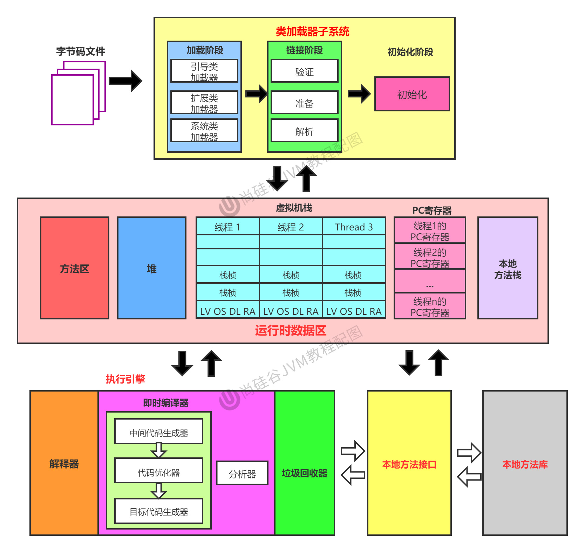

# 【JVM】


[toc]


相关教程：
[]()


## JVM

反编译命令：

```
javap -v Test.class
```


JVM：
	HotSpot（Oracle）
	JRockit（Oracle）
	J9（IBM）





## 类加载器子系统

类加载器子系统 / 类加载器：
	字节码文件：加载 → 链接 → 初始化
	方法区：类的信息、常量池


## 运行时数据区


## 执行引擎


