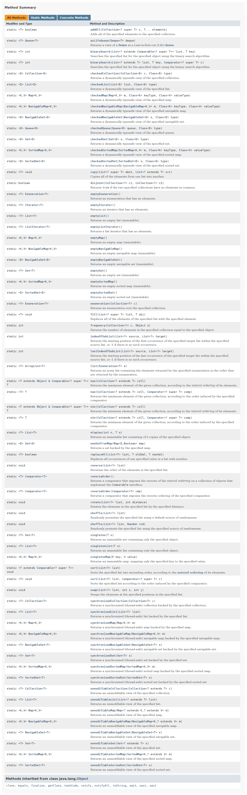

# 【Java集合】Collections


[toc]


## Collections

相关链接：
[Class Collections](https://docs.oracle.com/javase/8/docs/api/java/util/Collections.html)



## 排序

### sort

#### 基本数据类型

```java
import java.util.ArrayList;
import java.util.Collections;

public class Test {
	public static void main(String[] args) {
		ArrayList<Integer> a = new ArrayList<Integer>();
		a.add(4);
		a.add(1);
		a.add(3);
		a.add(2);
		a.add(0);
		System.out.println(a);
		Collections.sort(a);
		System.out.println(a);
	}
}
```

运行结果：

```
[4, 1, 3, 2, 0]
[0, 1, 2, 3, 4]
```


#### 引用数据类型

```java
import java.util.ArrayList;
import java.util.Collections;
import java.util.Comparator;

public class Test {
	public static void main(String[] args) {
		ArrayList<Student> a = new ArrayList<>();
		a.add(new Student("张三", 18));
		a.add(new Student("张三", 19));
		a.add(new Student("张三", 20));
		a.add(new Student("李四", 18));
		a.add(new Student("李四", 19));
		a.add(new Student("李四", 20));
		a.add(new Student("王五", 18));
		a.add(new Student("王五", 19));
		a.add(new Student("王五", 20));
		System.out.println(a);
		Collections.sort(a, new Comparator<Student>() {
			public int compare(Student s1, Student s2) {
				int i1 = s1.getAge() - s2.getAge();
				int i2 = s1.getName().compareTo(s2.getName());
				return i1 == 0 ? i2 : i1;
			}
		});
		System.out.println(a);

	}
}

class Student {
	private String name;
	private int age;

	public Student() {

	}

	public Student(String name, int age) {
		super();
		this.name = name;
		this.age = age;
	}

	public String getName() {
		return name;
	}

	public void setName(String name) {
		this.name = name;
	}

	public int getAge() {
		return age;
	}

	public void setAge(int age) {
		this.age = age;
	}

	public String toString() {
		return "Student[Name:" + name + " Age:" + age + "]";
	}

	public boolean equals(Object obj) {
		if (this == obj) {
			return true;
		}
		if (obj == null) {
			return false;
		}
		if (obj instanceof Student) {
			Student s = (Student) obj;
			if (this.name == s.name && this.age == s.age) {
				return true;
			}
		}
		return false;
	}
}
```

运行结果：

```
[Student[Name:张三 Age:18], Student[Name:张三 Age:19], Student[Name:张三 Age:20], Student[Name:李四 Age:18], Student[Name:李四 Age:19], Student[Name:李四 Age:20], Student[Name:王五 Age:18], Student[Name:王五 Age:19], Student[Name:王五 Age:20]]
[Student[Name:张三 Age:18], Student[Name:李四 Age:18], Student[Name:王五 Age:18], Student[Name:张三 Age:19], Student[Name:李四 Age:19], Student[Name:王五 Age:19], Student[Name:张三 Age:20], Student[Name:李四 Age:20], Student[Name:王五 Age:20]]
```


## 搜索

### binarySearch

```java
import java.util.ArrayList;
import java.util.Collections;

public class Test {
	public static void main(String[] args) {
		ArrayList<Integer> a = new ArrayList<Integer>();
		a.add(0);
		a.add(1);
		a.add(2);
		a.add(3);
		a.add(4);
		System.out.println(a);
		int i = Collections.binarySearch(a, 2);
		System.out.println(i);
	}
}
```

运行结果：

```
[0, 1, 2, 3, 4]
2
```


## 反转

### reverse

```java
import java.util.ArrayList;
import java.util.Collections;

public class Test {
	public static void main(String[] args) {
		ArrayList<Integer> a = new ArrayList<Integer>();
		a.add(0);
		a.add(1);
		a.add(2);
		a.add(3);
		a.add(4);
		System.out.println(a);
		Collections.reverse(a);
		System.out.println(a);
	}
}
```

运行结果：

```
[0, 1, 2, 3, 4]
[4, 3, 2, 1, 0]
```


## 打乱

### shuffle

```java
import java.util.ArrayList;
import java.util.Collections;

public class Test {
	public static void main(String[] args) {
		ArrayList<Integer> a = new ArrayList<Integer>();
		a.add(0);
		a.add(1);
		a.add(2);
		a.add(3);
		a.add(4);
		System.out.println(a);
		Collections.shuffle(a);
		System.out.println(a);
	}
}
```

运行结果：

```
[0, 1, 2, 3, 4]
[3, 4, 1, 0, 2]
```

